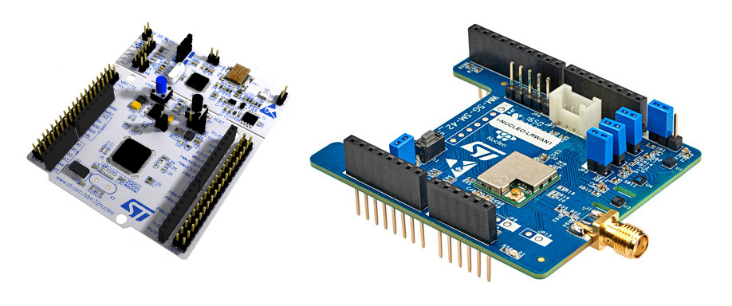
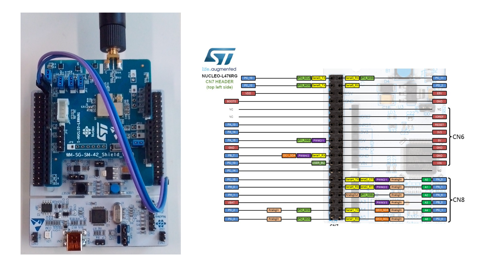
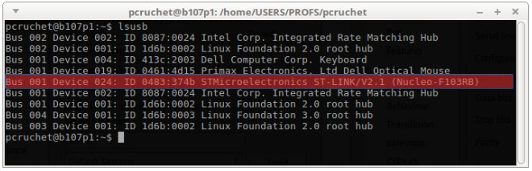
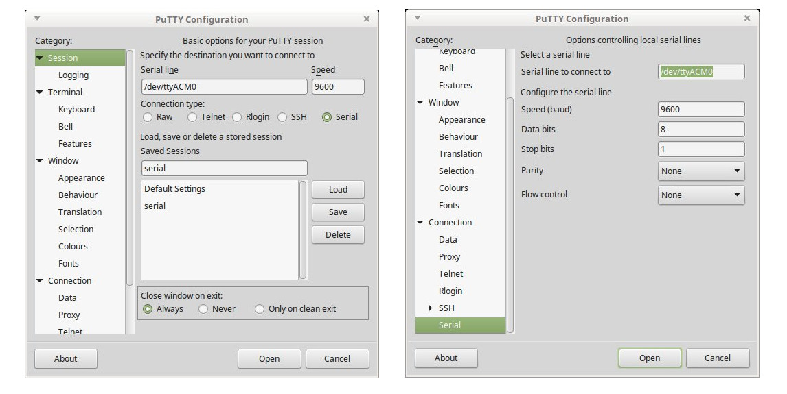
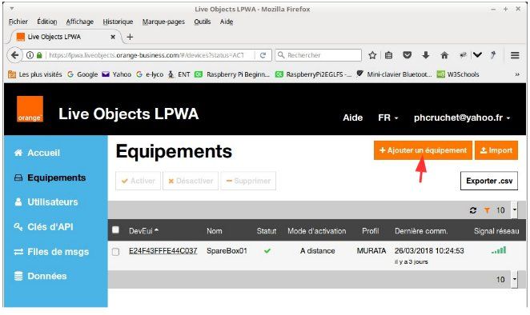
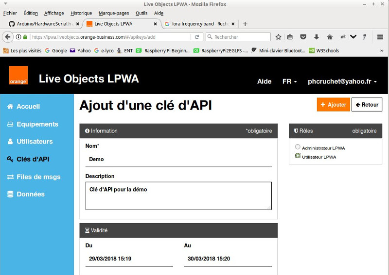
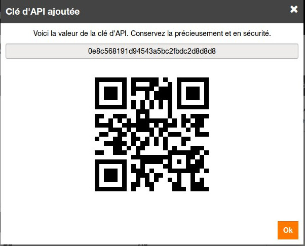

IOT avec Lora
=======

***

L'objectif de cette présentation est de réaliser une maquette pour mettre en oeuvre un IOT sur le réseau Live Objetc LPWA d'Orange en utilisant les commandes AT et récupération des données avec le protocole REST via curl.

Matériel utilisé pour l'IOT :
=
Le système mis en oeuvre est réalisé à partir d'une carte **Nucleo-L476** et d'une carte d'extension **I-Nucleo-LRAW1** de la société ST. La carte Nucleo-L476 a pour objectif de transmettre les commandes AT reçues sur le port USB vers la carte d'extension.
 
La carte d'extension I-Nucleo LRAW1 est pilotée par la liaison série nommée M_LPUART (TX et RX). l'interconnexion des deux cartes est donc réalisé de la manière suivante :
 
Le port **Serial3** peut être utilisé à cet usage. Ainsi les broches **PC_10** et **PC_11** de la carte mère sont respectivement relièes aux broches **M_LPUART_RX** et  **M_LPUART_TX** sur le connecteur C9 de la carte d'extension.

Programmation de la carte Nucléo-L476 :
==

La carte Nucleo-L476 est basée sur la technologie STM32. Le développement logiciel est réalisé avec la plateforme Arduino IDE.

	/*
	  Pont serie
	  fil entre PC10 et PA2
	  fil entre PC11 et PA3
	*/
	
	//#include <HardwareSerial.h>
	
	HardwareSerial Serial3(PC_11, PC_10); // PC11 = RX PC10 = TX
	
	void setup() 
	{
	  Serial.begin(9600);
	  Serial3.begin(115200);
	}
	
	// the loop function runs over and over again forever
	void loop() 
	{
	  char c;
	
	  if (Serial3.available() > 0) 
	  {
	        c = Serial3.read();
	        Serial.print(c);
	  }
	  if (Serial.available() > 0) 
	  {
	        c = Serial.read();
	        Serial3.print(c);
	  }
	}
Lorsque la carte est branchée sur l'ordinateur avec le câble mini USB, il est possible de vérifier qu'elle est reconnue par le système avec la commande **lsusb** :
 
Vérification à l'aide de putty. Le nom du port série peut changer.
 
Maintenant, avec PuTTY, les commandes AT peuvent être envoyées sur la carte d'extension qui servira lors de la déclaration de l'équipement.

	#AT
	ok
PuTTY permet également de récupérer l'identifiant **DevEui** de la carte d'extension.

	#AT+EUI
	e2,4f,43,ff,fe,44,be,8c
	ok

Déclaration de l'IOT dans la plateforme Live Objetc LPWA d'Orange :
==

Après connexion sur le [site d'orange](https://lpwa.liveobjects.orange-business.com/#/login), il est nécessaire d'ajouter le nouvel équipement sur la plateforme.
  
 Les informations concernant cet équipement sont par exemple :
    
  Pour la carte d'extension I-NUCLEO-LRAW1, le profil est obligatoirement **MURATA** qui correspond à la puce utilisé par ST. Le **DevEui** soit un identifiant unique sur 64 bits (8 octets) est celui relevé avec la commande AT+EUI. Les deux autres champs, **AppEui** avec une valeur sur 64 bits (8 octets) et **AppKey** avec une valeur sur 128 bits (16 octets) sont à déterminer en fonction de l'application, ils sont là pour sécuriser l'accès au cloud.

Envoi de données sur le cloud Orange :
==

Dans un premier temps, il est nécessaire de finir le paramétrage de l'IOT avant de pouvoir envoyer des données.

	ATE=1                                    // pour avoir de l'écho avec PuTTY
	AT+APPEUI=1122334455667788               // L'AppEui défini lors de la déclaration de l'objet
	AT+AK=112233445566778899AABBCCDDEEFF00   // L'AppKey défini  lors de la déclaration de l'objet
	AT+DC=0                                  // Désactive le rapport cyclique afin de pouvoir envoyer plusieurs fois de suite des données
	AT+DEFMOD=6                              // 6 = Mode pour LoraWAN
	AT+CLASS=0                               // 0 pour la classe A
	AT+BAND=0                                // pour la bande de fréquence européenne 868 MHz
	AT+WDCT                                  // Sauvegarde de la configuration
	
le paramétrage du mode, de la classe et de la bande de fréquence correspondent aux valeurs par défaut, il n'est pas forcement nécessaire de les configurer. L'envoi de données peut alors être réalisé par les commandes suivantes :	

	AT+JOIN=1		// Pour joindre une passerelle en mode OTAA, mode uniquement supporté par Orange actuellement.
	
La carte d'extension répond **Ok** dans un premier temps et lorsque la passerelle accèpte la connexion le message **+JoinAccepted** apparaît, cela demande quelques secondes avant d'avoir cette réponse. Une fois reçue, l'envoi de données peut être réalisé.

	AT+SEND=2,001122334455,1 	  //Ecriture sur le port 2 des valeurs 001122334455 et demande d'accusé de réception (le 3ème paramètre à 1)

Récupération des données sur le cloud Orange :
==

Pour obtenir les données à partir du cloud, une clé API doit être défini avec un **rôle d'utilisateur LPWA**. Elle peut être ajoutée comme l'indique la figure suivante :
 
Seul le nom de la clé et la date de limite de validité sont à saisir obligatoirement, la description est facultative. Pour terminer, l'appui sur le bouton ajouter fait apparaitre la nouvelle fenêtre indiquant la valeur de la clé. Cette valeur est à conserver précieusement, elle sera utile pour interroger le cloud. Elle ne peut plus être obtenue lorsque la fenêtre est fermée.
 
Pour dialoguer avec le cloud, l'**API REST** permet d'établir les échanges avec une commande **curl**. Dans l'entête, API-KEY doit correspondre à la clé API obtenue précédement. Par exemple la commande suivante donne la liste des Objets déclarés sur le cloud Orange.

	curl -X GET --header 'Accept: application/json' --header 'X-API-KEY: 0e8c568191d94543a5bc2fbdc2d8d8d8' 'https://liveobjects.orange-business.com/api/v0/vendors/lora/devices?size=20&page=0'
Résultats obtenus :

	{
	  "page" : 0,
	  "size" : 20,
	  "totalCount" : 2,
	  "data" : [ {
	    "devEUI" : "E24F43FFFE44C037",
	    "name" : "SpareBox01",
	    "activationType" : "OTAA",
	    "profile" : "MURATA",
	    "deviceStatus" : "ACTIVATED",
	    "tags" : [ ],
	    "lastActivationTs" : "2018-03-26T08:44:32.230Z",
	    "lastCommunicationTs" : "2018-03-26T08:24:53.779Z",
	    "lastSignalLevel" : 5,
	    "lastDlFcnt" : 1,
	    "lastUlFcnt" : 1,
	    "creationTs" : "2018-03-26T08:44:32.230Z",
	    "updateTs" : "2018-03-26T08:44:32.230Z"
	  }, {
	    "devEUI" : "E24F43FFFE44BE8C",
	    "name" : "SpareBox02",
	    "activationType" : "OTAA",
	    "profile" : "MURATA",
	    "deviceStatus" : "ACTIVATED",
	    "tags" : [ ],
	    "lastActivationTs" : "2018-03-29T12:36:15.581Z",
	    "creationTs" : "2018-03-29T12:36:15.581Z",
	    "updateTs" : "2018-03-29T12:36:15.581Z"
	  } ]
	  
Ici deux objets ont été trouvés, l'objet **SpareBox02** apparaît bien dans la liste avec son DevEui et ses autres caractéristiques. 
Enfin la commande curl suivante retourne les données envoyées sur le cloud. Il est toujours nécessaire de fournir API KEY mais également le DevEui de l'objet que l'on souhaite interroger.

	curl -X GET --header 'Accept: application/json' --header 'X-API-KEY: 0e8c568191d94543a5bc2fbdc2d8d8d8' 'https://liveobjects.orange-business.com/api/v0/data/streams/urn:lora:E24F43FFFE44BE8C!uplink'

Réponse obtenue :

		[ {
		  "id" : "5ab8b5217676a77b8504d84e",
		  "streamId" : "urn:lora:E24F43FFFE44C037!uplink",
		  "timestamp" : "2018-03-26T08:24:53.779Z",
		  "model" : "lora_v0",
		  "value" : {
		  "payload" : "001122334455"
		  },
		  "tags" : [ ],
		  "metadata" : {
		    "source" : "urn:lora:E24F43FFFE44BE8C",
		    "connector" : "lora",
		    "network" : {
		      "lora" : {
		        "devEUI" : "E24F43FFFE44BE8C",
		        "port" : 2,
		        "fcnt" : 1,
		        "rssi" : -88.0,
		        "snr" : 6.25,
		        "sf" : 12,
		        "signalLevel" : 5
		      }
		    }
		  },
		  "created" : "2018-03-26T08:53:53.292Z"
		  ]
		  
Dans le champ **payload**, on retrouve les données envoyées par l'objet connecté soit : **001122334455**.

	
	